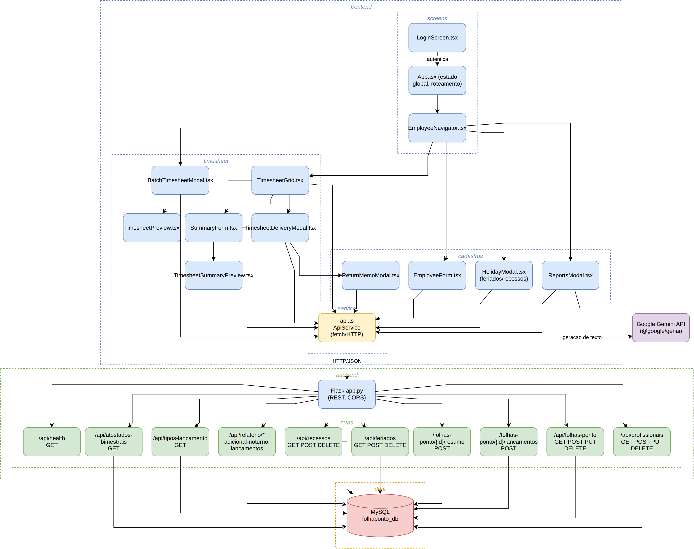
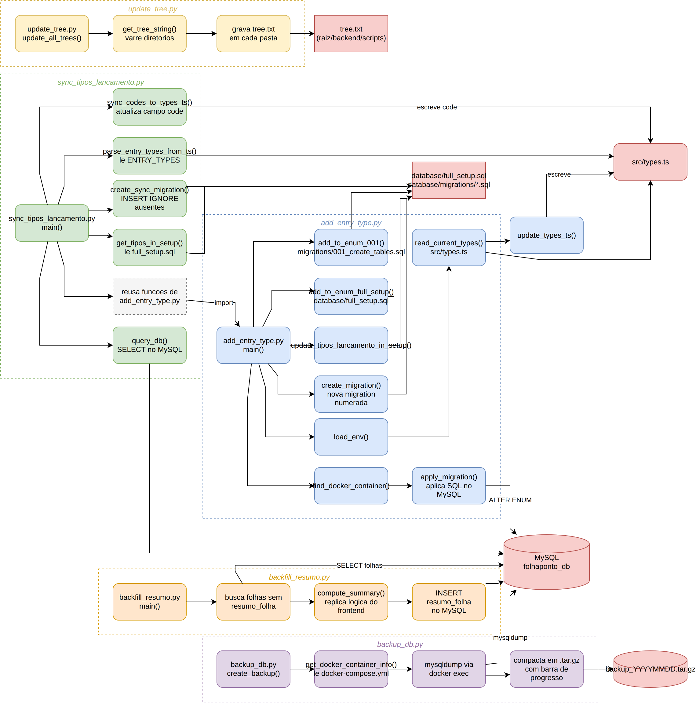
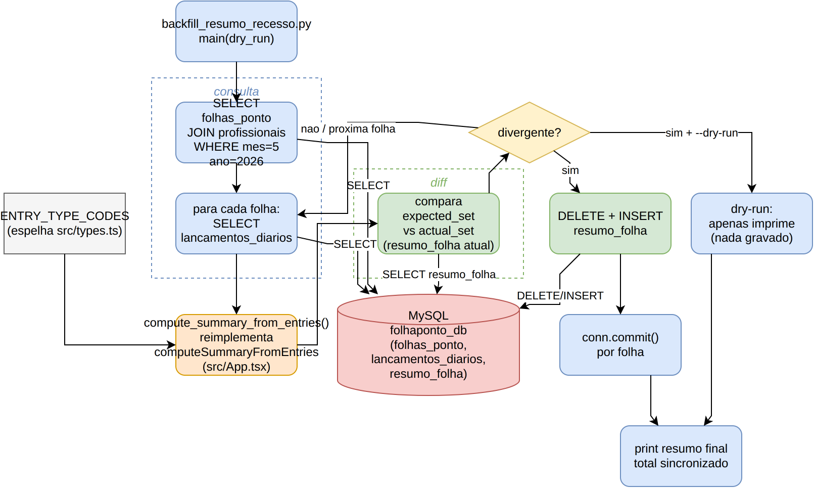
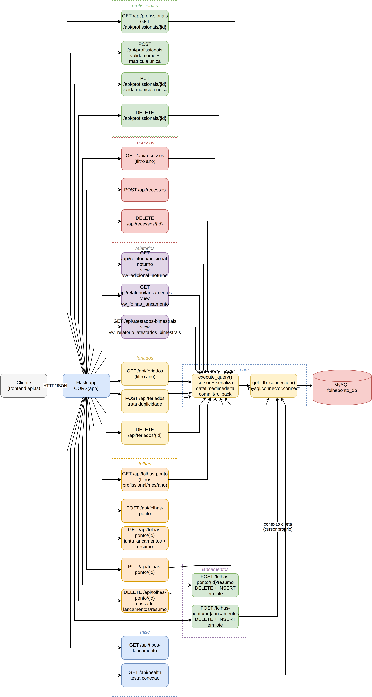

# 📋 Gestor Folha Ponto — Secretaria de Estado de Educação

> **Sistema moderno e intuitivo** para geração, gerenciamento e impressão de folhas de frequência de servidores públicos.  
> Desenvolvido com **React 19**, **TypeScript**, **Tailwind CSS** e **MySQL 8**.

---

## ✨ Funcionalidades Destaque

### 🔐 Autenticação Segura
- Tela de login com credenciais configuráveis via `.env`
- Acesso protegido ao sistema (usuário + senha)
- Interface dark com tema cyberpunk

### 📊 Gerenciamento de Profissionais
- **CRUD completo**: criar, editar, visualizar, excluir servidores
- **Matrícula opcional** para temporários e prestadores
- **Navegação rápida**: setas, dropdown, índice visual (N de Total)

### 📅 Calendário Inteligente
- Geração automática de dias conforme mês/ano
- Suporte a **dois turnos independentes** (20h ou 40h)
- Segundo turno habilitado automaticamente para carga de 40h

### ⚡ Pré-Preenchimento Inteligente
- Detecta padrões de **CPIP** e **CURSO FORMAÇÃO** de folhas anteriores
- Mapeia por **posição semanal + dia da semana** (3ª segunda ≠ 4ª segunda)
- Botão com barra de progresso para aplicação rápida

### 🗓️ Gerenciamento de Feriados
- Modal exclusivo para adicionar/aplicar/reverter feriados
- Feriados salvos no banco para reutilização no mesmo ano
- Aplicação dinâmica com um clique

### 🎯 Tipos de Lançamento (21 Opções)
Trabalho Normal, Férias, Recesso, Atestado Médico, Licença Médica, Falta, TRE, Abono de Ponto, CPIP, Curso Formação, Abono Aniversário, Feriado, Abono Art. 151, Falta Paralisação, Atestado de Comparecimento, e mais.

### 📄 Resumo da Frequência (Página 2)
- **Auto-preenchimento automático** baseado em lançamentos com código oficial
- Tabela de operação (Inclusão, Alteração, Exclusão)
- **Formato "U"** para números: `|_|` (fiel ao formulário oficial)
- Referência rápida de códigos integrada

### 🖨️ Impressão A4 Completo
- Duas páginas otimizadas (210mm × 297mm)
- Layout sem espaços em branco
- Compatível com navegadores (Ctrl+P ou ícone impressora)

### 📦 Geração em Lote
- Selecione múltiplos profissionais + mês/ano
- Filtro por cargo
- Aplica pré-preenchimento automaticamente
- Barra de progresso em tempo real
- Imprime todas as folhas em sequência

### 📱 Responsividade Total
- Desktop, tablet e mobile
- Interface adaptativa com Tailwind CSS

---

## 🚀 Guia Rápido

### 1. Setup Automático (Recomendado)
```bash
# Clone o repositório
git clone <url-do-repositorio>
cd FolhapontogoogleAi

# Inicie todos os serviços com Docker Compose
docker-compose up -d

# Acesse em: http://localhost:3000
# Credenciais padrão: admin / senha123 (.env)
```

### 2. Primeira Entrada
- **Mês/Ano**: Selecione no topo
- **Dados do Servidor**: Nome, matrícula (opcional), cargo, UA, exercício, unidade, turnos
- **Grade**: Para cada dia, escolha o tipo de lançamento
- **Botões auxiliares**:
  - **Pré Preenchimento**: replica padrões CPIP/CURSO
  - **Limpar**: reseta tudo para TRABALHO NORMAL
  - **Feriados**: abre modal de gerenciamento

### 3. Resumo da Frequência
- Preenchimento automático conforme lançamentos com código oficial
- Complemente manualmente se necessário
- Campos: Operação, Código, Carga Horária, Meses, Intervalo de Dias

### 4. Impressão
- Clique em **Visualizar** para conferir layout
- Use **Ctrl+P** ou ícone impressora no header
- Salve como PDF ou imprima direto

---

## 📸 Interface em Ação

### Tela Principal — Editor de Lançamentos


*Interface de edição e validação de frequências diárias com tema cyberpunk e sincronização automática.*

### Página 1 — Formulário Oficial
Reproduz fidedignamente o formulário da SEE com:
- Cabeçalho: UA, Exercício, Unidade, Nome, Matrícula
- Grade 31 dias × 2 turnos
- Campos de observação
- Assinatura e datas

### Página 2 — Resumo da Frequência
Tabela de operações com:
- Coluna: Operação (I/A/E)
- Coluna: Código oficial (ex: 99902=FÉRIAS)
- Coluna: Carga horária
- Coluna: Meses
- Coluna: Intervalo de dias (formato "U")
- Caixa MENSAGEM para observações

---

## 🛠️ Tecnologias

| Camada | Tecnologia | Versão |
|--------|-----------|--------|
| **Frontend** | React | 19 |
| **Linguagem** | TypeScript | 5.x |
| **Estilo** | Tailwind CSS | 4.x |
| **Ícones** | Lucide React | latest |
| **Animações** | Framer Motion | latest |
| **Build** | Vite | 6.x |
| **Backend** | Flask | 3.0 |
| **Banco** | MySQL | 8.0 |
| **Deploy** | Docker + Compose | latest |

---

## ⚙️ Configuração de Ambiente

### Variáveis Principais (`.env`)
```bash
# Ambiente (local | docker)
VITE_ENVIRONMENT=local

# Autenticação
VITE_APP_USERNAME=admin
VITE_APP_PASSWORD=senha123

# Banco de Dados
DB_HOST=localhost
DB_PORT=3306
DB_USER=root
DB_PASSWORD=SUA_SENHA_AQUI
DB_NAME=folhaponto_db
```

### Ambientes Suportados

| Ambiente | Uso | Frontend | Backend | Proxy |
|----------|-----|----------|---------|-------|
| **Local** | Desenvolvimento | http://localhost:3000 | http://localhost:5000 | localhost:5000 |
| **Docker** | Produção | http://localhost:3000 | backend:5000 (interno) | backend:5000 |

O Vite detecta automaticamente via `VITE_ENVIRONMENT` e ajusta o proxy.

---

## 📁 Estrutura do Projeto

```
FolhapontogoogleAi/
├── src/                          # Frontend React + TypeScript
│   ├── components/               # 9 componentes reutilizáveis
│   │   ├── LoginScreen.tsx       # Autenticação
│   │   ├── EmployeeForm.tsx      # Dados do servidor
│   │   ├── TimesheetGrid.tsx     # Grade de lançamentos
│   │   ├── TimesheetPreview.tsx  # Página 1 (impressão)
│   │   ├── TimesheetSummaryPreview.tsx  # Página 2 (resumo)
│   │   ├── HolidayModal.tsx      # Gerenciador de feriados
│   │   ├── BatchTimesheetModal.tsx # Geração em lote
│   │   └── ...
│   ├── services/api.ts           # Comunicação com backend
│   ├── types.ts                  # 21 tipos de lançamento + interfaces
│   └── App.tsx                   # Orquestração principal
│
├── backend/                       # API Flask
│   ├── app.py                    # 15+ endpoints REST
│   └── Dockerfile
│
├── database/                      # MySQL + Migrations
│   ├── full_setup.sql            # Setup com seed data
│   ├── migrations/               # 20 migrations organizadas
│   │   ├── 001_create_tables.sql
│   │   ├── 003_add_second_turn_columns.sql
│   │   ├── 011_create_feriados_table.sql
│   │   ├── 016_create_vw_eventos_consolidados.sql
│   │   ├── 017_create_recessos_table.sql
│   │   ├── 018_create_schema_migrations.sql
│   │   ├── 019_recessos_unique_constraint.sql
│   │   ├── 020_create_vw_atestados_comparecimento.sql
│   │   └── ...
│   └── Dockerfile
│
├── scripts/                       # Automação
│   ├── add_entry_type.py         # Adicionar novos tipos
│   ├── sync_tipos_lancamento.py  # Sincronizar tipos ↔ banco
│   ├── backfill_resumo.py        # Backfill de resumos
│   ├── backup_db.py              # Backup/restore
│   └── update_tree.py            # Gera tree.txt de cada pasta
│
├── backend/scripts/               # Scripts one-off do backend
│   └── backfill_resumo_recesso.py
│
├── docs/diagrams/                 # Diagramas de arquitetura (draw.io)
│   ├── folhaponto-arquitetura.drawio(.png)
│   ├── scripts-fluxo.drawio(.png)
│   ├── backend-scripts-fluxo.drawio(.png)
│   └── app-py-fluxo.drawio(.png)
│
├── docker-compose.yml            # Orquestração (dev + prod)
├── vite.config.ts                # Proxy condicional
├── README.md                      # Este arquivo
└── tree.txt                       # Árvore de arquivos comentada
```

---

## 🎯 Fluxo de Dados

```
┌──────────┐
│ Servidor │ (nome, matrícula, carga, turnos)
└────┬─────┘
     │
     ▼
┌──────────────────┐
│  Folha Ponto     │ (mes, ano, servidor_id)
└────┬─────────────┘
     │
     ├─────────────────────────────────┐
     ▼                                 ▼
┌─────────────────┐          ┌──────────────────┐
│ Lançamentos     │          │ Resumo Folha     │
│ Diários (31×2)  │          │ (até 8 linhas)   │
│ + Observações   │          │ + Operações      │
└─────────────────┘          └──────────────────┘
```

---

## 🔧 Scripts Auxiliares

### Adicionar Novo Tipo de Lançamento
```bash
python3 add_entry_type.py
# Interage com usuário, atualiza:
# - src/types.ts
# - full_setup.sql
# - migrations/001_create_tables.sql
# - Cria migration numerada
# - Aplica no banco (Docker ou local)
```

### Sincronizar Tipos ↔ Banco
```bash
python3 sync_tipos_lancamento.py
# Verifica discrepâncias entre src/types.ts e banco
# Sincroniza códigos bidirecionalmente
```

### Backfill de Resumos
```bash
python3 backfill_resumo.py
# Preenche resumo_folha para todas as folhas existentes
# Preserva dados manuais (seguro)
```

---

## 📊 Endpoints da API

| Método | Endpoint | Descrição |
|--------|----------|-----------|
| `GET` | `/api/profissionais` | Listar servidores |
| `POST` | `/api/profissionais` | Criar servidor |
| `PUT` | `/api/profissionais/<id>` | Atualizar servidor |
| `DELETE` | `/api/profissionais/<id>` | Excluir servidor + folhas |
| `GET` | `/api/folhas-ponto` | Listar folhas (filtros opcionais: profissional_id, mes, ano) |
| `GET` | `/api/folhas-ponto/<id>` | Obter folha específica com lançamentos e resumo |
| `POST` | `/api/folhas-ponto` | Criar folha |
| `PUT` | `/api/folhas-ponto/<id>` | Atualizar folha |
| `DELETE` | `/api/folhas-ponto/<id>` | Excluir folha |
| `POST` | `/api/folhas-ponto/<id>/lancamentos` | Salvar lançamentos diários em lote |
| `POST` | `/api/folhas-ponto/<id>/resumo` | Salvar resumo da folha em lote |
| `GET` | `/api/feriados` | Listar feriados do ano |
| `POST` | `/api/feriados` | Criar feriado |
| `DELETE` | `/api/feriados/<id>` | Excluir feriado |
| `GET` | `/api/recessos` | Listar recessos do ano |
| `POST` | `/api/recessos` | Criar recesso |
| `DELETE` | `/api/recessos/<id>` | Excluir recesso |
| `GET` | `/api/relatorio/adicional-noturno?mes=&ano=` | Relatório de adicional noturno |
| `GET` | `/api/relatorio/lancamentos?mes=&ano=` | Relatório de lançamentos |
| `GET` | `/api/relatorio/resumo?ano=` | Resumo anual de ocorrências por profissional (jan → hoje) |
| `GET` | `/api/tipos-lancamento` | Listar tipos de lançamento |
| `GET` | `/api/atestados-bimestrais?matricula=&ano=` | Contagem de atestados por bimestre |
| `GET` | `/api/atestados-comparecimento?matricula=&ano=` | Contagem de comparecimentos por mês (limite 12/ano) |
| `GET` | `/api/health` | Health check da API |


---

## 🐳 Deploy com Docker

### Desenvolvimento
```bash
docker-compose up -d
docker-compose logs -f
# Acesso: http://localhost:3000
```

### Produção
```bash
docker-compose -f docker-compose.prod.yml up -d
# Nginx proxy + frontend otimizado + backend em gunicorn
```

### Parar Serviços
```bash
docker-compose down
docker-compose down -v  # com volumes
```

---

## 🔐 Segurança

- ✅ **Credenciais**: Definidas em `.env` (não no código)
- ✅ **API Key exposta**: NÃO EXISTEM no projeto
- ✅ **CORS**: Configurado para `localhost`
- ✅ **SQL**: Prepared statements via ORM/Connector
- ⚠️ **Autenticação frontend**: Básica (para uso interno)
  - Para produção pública: implemente OAuth2/JWT no backend

---

## 🗺️ Diagramas de Arquitetura

Diagramas `.drawio` (editáveis) com PNG exportado, em [`docs/diagrams/`](docs/diagrams/):

### 1. Visão Geral da Arquitetura

*Visão geral do projeto: telas React → `api.ts` → rotas Flask → MySQL, incluindo chamada ao Gemini API.*

### 2. Funcionamento dos Scripts

*Funcionamento dos scripts em `scripts/` (add_entry_type, sync_tipos_lancamento, backfill_resumo, backup_db, update_tree).*

### 3. Fluxo de Scripts do Backend

*Fluxo do script `backend/scripts/backfill_resumo_recesso.py`.*

### 4. Fluxo de app.py (Backend)

*Fluxo direto do `backend/app.py`: cada rota agrupada por recurso até `execute_query()`/MySQL.*

Abra os arquivos `.drawio` no [draw.io](https://app.diagrams.net/) para editá-los diretamente, ou use as imagens PNG exportadas correspondentes.

---

## 🤝 Como Contribuir

1. Crie uma branch: `git checkout -b feat/sua-feature`
2. Commit com mensagem clara: `git commit -m "feat: descrição"`
3. Push: `git push origin feat/sua-feature`
4. Abra um Pull Request

---

## 📝 Licença

Apache License 2.0 — veja `LICENSE` para detalhes.

---

## 📞 Suporte e Documentação

- **Setup detalhado**: veja `README_SETUP.md`
- **Histórico de alterações**: `MODIFICATION_MEMORY.md`
- **Backend**: `backend/README.md`
- **Banco de dados**: `database/README.md`
- **Frontend**: `src/README.md`
- **Componentes**: `src/components/README.md`

---

**Desenvolvido com ❤️ para facilitar a vida do servidor público.**

*Last updated: 2026-07-30*
