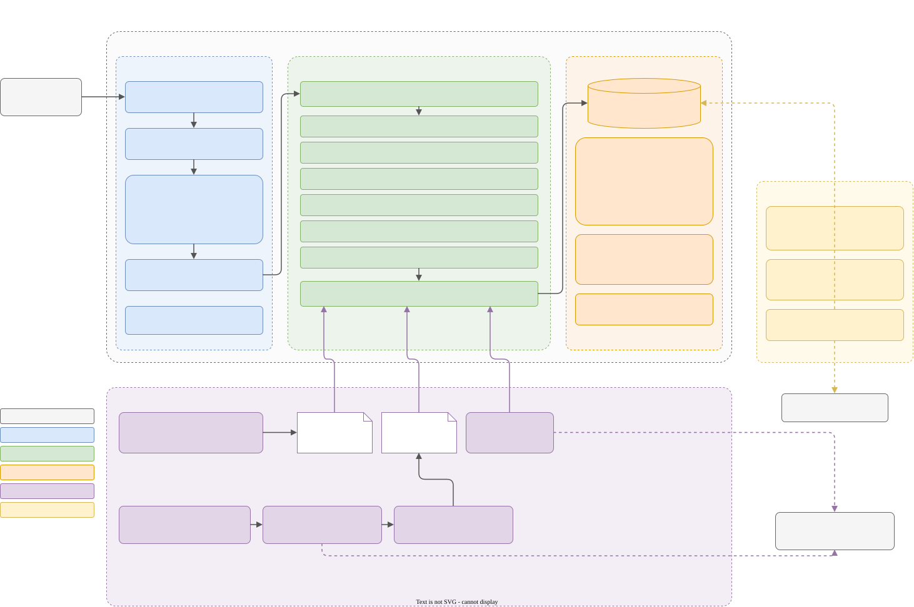
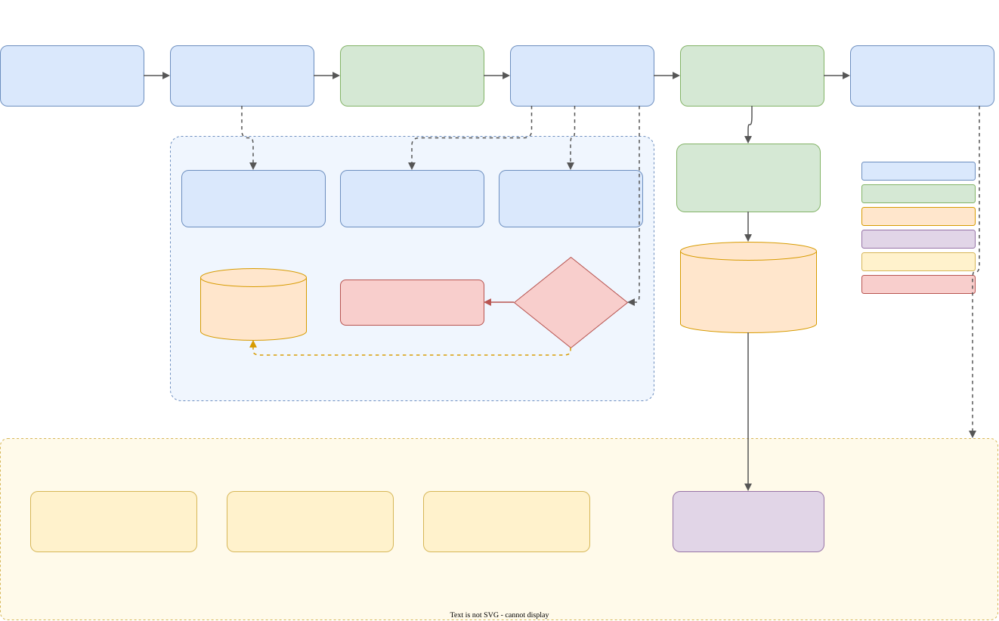
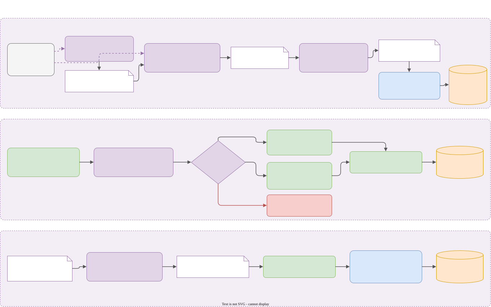
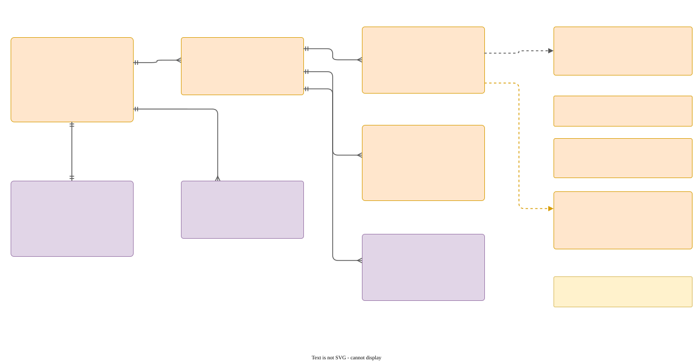
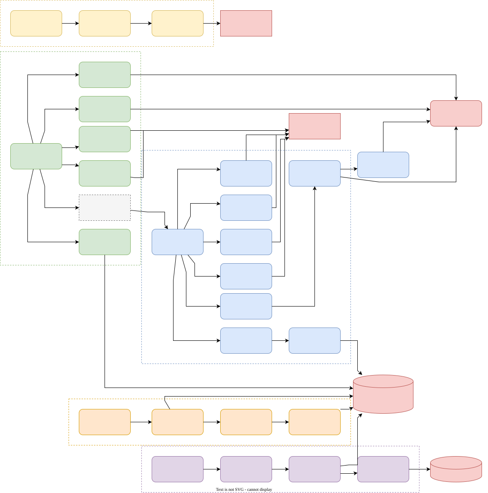

<div align="center">

# 📋 Gestor Folha Ponto

**Gere, preencha, confira e imprima folhas de frequência de servidores — sem planilha, sem retrabalho.**


[Visão geral](#-visão-geral) ·
[Como funciona](#-como-funciona) ·
[Funcionalidades](#-funcionalidades) ·
[Começando](#-começando) ·
[Integrações](#-integrações-sigep-e-educasync) ·
[Dados](#️-modelo-de-dados) ·
[API](#-api-rest) ·
[Operação](#-operação-e-manutenção)

</div>

---

## 🧭 Visão geral

O **Gestor Folha Ponto** substitui o preenchimento manual das folhas de frequência mensais. Para cada servidor e mês, o sistema monta a grade de dias, aplica feriados, recessos e padrões recorrentes, calcula sozinho o **resumo de ocorrências com códigos oficiais** e imprime o formulário em **duas páginas A4**, prontas para assinatura.

Em volta disso, ele cuida do que vem antes e depois da folha:

| Antes | Durante | Depois |
|---|---|---|
| 👥 Cadastro de servidores (manual, **EducaSync** ou **SIGEP**) | ✏️ Grade 31 dias × 2 turnos com auto-save | 🖨️ Impressão individual ou em lote |
| 🗓️ Feriados e recessos do ano | ⚡ Pré-preenchimento de CPIP / Curso | 📊 Relatórios mensais e anuais |
| 🏷️ Tipos de lançamento com código oficial | ⛔ Críticas de limite de atestados | 📨 Memorandos de entrega e devolução |
| | 📄 Resumo (Página 2) automático | 🤖 Robô que lança os eventos no SIGEP |

---

## 🏛️ Como funciona

Três containers (**nginx + React**, **Flask**, **MySQL**) sobem com Docker Compose. Scripts Python locais fazem a ponte com sistemas externos (SIGEP e PDFs do EducaSync) e deixam arquivos JSON que o backend lê.



<details>
<summary><b>Legenda de cores (vale para todos os diagramas)</b></summary>

| Cor | Camada |
|---|---|
| 🟦 Azul | Frontend React (`src/`) |
| 🟩 Verde | Backend Flask (`backend/app.py`) |
| 🟧 Laranja | Banco MySQL (`database/`) |
| 🟪 Roxo | Integrações SIGEP / EducaSync (`sigep/`, `educasync/`) |
| 🟨 Amarelo | Operação e scripts (`scripts/`, `folha_manager.sh`) |
| 🟥 Vermelho | Bloqueios e regras de negócio |

</details>

### 🔁 Ciclo de vida de uma folha

Do login à entrega: escolha o servidor e o mês, preencha a grade (com ajudantes), o sistema salva a cada mudança e gera o resumo; no fim do mês saem relatórios, memorandos e o lançamento no SIGEP.



---

## ✨ Funcionalidades

### 👥 Servidores
- **CRUD completo** com navegação rápida (anterior/próximo, lista, posição *N de total*).
- Campos: nome, matrícula (opcional para temporários/prestadores), status **Ativo/Inativo**, cargo, disciplina, função, UA, exercício, unidade de lotação, carga horária (**20h ou 40h**) e turnos.
- **Dados complementares do SIGEP** (admissão, PcD, readaptação, cargas horárias, cursos…) em um card logo abaixo do cadastro.

### ✏️ Grade de lançamentos (Página 1)
- Dias gerados automaticamente pelo mês/ano; **dois turnos independentes** (o 2º turno só abre para 40h).
- **Tipos de lançamento dinâmicos** vindos do banco — Trabalho Normal, Férias, Recesso, Atestado Médico, Licença Médica, Falta, TRE, Abono de Ponto, CPIP, Curso Formação, Abono Aniversário, Feriado, Abono Art. 151, Falta Paralisação, Atestado de Comparecimento e outros.
- **Auto-save**: cada alteração relevante grava folha, lançamentos e resumo (`saveCompleteTimesheet`).

### ⚡ Pré-preenchimento inteligente
- Detecta os padrões de **CPIP** e **Curso de Formação** nas folhas anteriores.
- Mapeia por **posição semanal + dia da semana** (a 3ª segunda ≠ a 4ª segunda).
- Insere automaticamente a observação padrão do curso.

### 🗓️ Feriados e recessos
- Modal com duas abas: feriados (dia) e recessos (intervalo de datas).
- Salvos por ano no banco; **aplicar** e **reverter** com um clique, com auto-save.

### ⛔ Críticas de atestados
- **Bimestral** — atestado médico de até 3 dias: bloqueia se já houver ocorrência no bimestre.
- **Anual** — atestados de comparecimento: bloqueia acima de **12 por ano** (banco + tela).
- As contagens vêm das views `vw_relatorio_atestados_*`.

### 📄 Resumo da frequência (Página 2)
- Gerado por `computeSummaryFromEntries()`: agrupa dias consecutivos com o mesmo **código oficial** (ex.: `99902` = Férias).
- Operação **I / A / E**, carga (`1` para 20h, `3` para 40h), meses e intervalo de dias no **formato "U"** `|_|`, fiel ao formulário.
- Pode ser complementado manualmente; tabela de códigos de referência impressa junto.

### 🖨️ Impressão
- Duas páginas **A4 (210 × 297 mm)** sem espaços vazios; `Ctrl+P` ou ícone da impressora.
- Dias especiais recebem traços nos campos de entrada/saída; para 20h o 2º turno sai bloqueado.

### 📦 Geração e impressão em lote
- Filtro por cargo e carga horária, seleção múltipla de servidores + mês/ano.
- Aplica o pré-preenchimento, mostra progresso em tempo real e imprime tudo em sequência.

### 📊 Relatórios (somente servidores ativos)
| Relatório | O que mostra |
|---|---|
| **Lançamentos efetuados** | Eventos do mês (exceto trabalho normal, CPIP e curso) agrupados em intervalos de dias |
| **Adicional noturno** | Servidores com turno noturno e dias trabalhados (`vw_adicional_noturno`) |
| **Resumo anual** | Ocorrências acumuladas de janeiro até hoje, por servidor |

### 📨 Memorandos
- **Entrega de folhas de ponto** (`TimesheetDeliveryModal`) e **devolução de servidor** (`ReturnMemoModal`), separados por vínculo (efetivos/temporários), prontos para impressão.

### 🔐 Acesso
- Tela de login com usuário e senha definidos no `.env` (uso interno).

---

## 🚀 Começando

### Pré-requisitos
- **Docker + Docker Compose** (caminho recomendado), ou
- **Node 20+**, **Python 3.11+** e **MySQL 8** para rodar localmente.

### 1. Com Docker (recomendado)

```bash
git clone <url-do-repositorio>
cd FolhapontogoogleAi
cp .env.example .env        # ajuste senhas e credenciais
docker-compose up -d
```

Acesse **http://localhost:3000**. O login é o definido em `VITE_APP_USERNAME` / `VITE_APP_PASSWORD` (padrão de exemplo `admin` / `senha123` — **troque**).

### 2. Localmente, pelo gerenciador

```bash
./folha_manager.sh          # menu interativo: opção 1 inicia backend + frontend
```

Detalhes de instalação manual em [`README_SETUP.md`](README_SETUP.md).

### 3. Primeira folha em 5 passos
1. Escolha **mês/ano** no topo.
2. Selecione (ou crie com **Novo**) o servidor.
3. Clique em **Pré Preenchimento** e em **Feriados** para aplicar o calendário do ano.
4. Ajuste dia a dia na grade — o resumo da Página 2 se atualiza sozinho.
5. **Visualizar** → `Ctrl+P` → imprimir ou salvar em PDF.

### ⚙️ Variáveis de ambiente (`.env`)

| Variável | Para quê | Exemplo |
|---|---|---|
| `DB_HOST` / `DB_PORT` | Endereço do MySQL | `localhost` / `3307` |
| `DB_USER` / `DB_PASSWORD` / `DB_NAME` | Credenciais do banco | `root` / — / `folhaponto_db` |
| `API_PORT` / `API_HOST` | Porta e interface do Flask | `5000` / `0.0.0.0` |
| `FLASK_DEBUG` | Debug do Flask (só em dev) | `false` |
| `VITE_ENVIRONMENT` | `local` ou `docker` — ajusta o proxy do Vite | `local` |
| `VITE_API_URL` | URL base da API (opcional) | — |
| `VITE_APP_USERNAME` / `VITE_APP_PASSWORD` | Login da tela inicial | `admin` / — |

| Ambiente | Frontend | Backend | Banco |
|---|---|---|---|
| **Local** | http://localhost:3000 (Vite) | http://localhost:5000 | localhost:3307 |
| **Docker** | http://localhost:3000 (nginx) | `backend:5000` via proxy `/api` | `db:3306` (exposto em 3307) |

---

## 🔌 Integrações SIGEP e EducaSync

Três fluxos independentes, todos rodados localmente e com login manual quando envolvem o SIGEP:

1. **SIGEP → fichas cadastrais** — `verificar_novos.py` encontra servidores novos, `raspar_fichas.py` baixa a ficha de cada um em PDF, `extrair_fichas.py` converte em JSON/XLSX e a aba **SIGEP** do modal de sincronização grava os dados complementares no banco.
2. **Folha → SIGEP (robô)** — `lancar_eventos.py` lê os eventos do mês pela API e os lança em *03.Lançamento*. Cada intervalo recebe a marca `JA_EXISTIA` ou `LANCADO`; sobreposição parcial vira **conflito** para revisão manual. Roda em modo **simulação** por padrão.
3. **EducaSync** — lê folhas de ponto em PDF (`educasync/educa_folha/`), gera `dados_folha_ponto.json` e o modal compara com o banco para aplicar divergências.



Guias completos: [`sigep/README.md`](sigep/README.md) · [`educasync/README.md`](educasync/README.md) · [`sigep.md`](sigep.md)

---

## 🗄️ Modelo de dados

Tudo gira em torno de **profissionais → folhas_ponto → lançamentos/resumo**. Os dados do SIGEP ficam em tabelas satélite e as views alimentam relatórios e críticas.



- O schema evolui por **migrations numeradas** (`database/migrations/001…026`), registradas em `schema_migrations`.
- `database/full_setup.sql` cria schema + dados de referência, **sem dados pessoais**.
- Mais em [`database/README.md`](database/README.md).

---

## 🔗 API REST

Base: `/api` · Flask em `backend/app.py` · todas as rotas passam por `execute_query()`.

<details>
<summary><b>👥 Profissionais</b></summary>

| Método | Endpoint | Descrição |
|---|---|---|
| `GET` | `/profissionais` | Listar servidores |
| `POST` | `/profissionais` | Criar servidor |
| `GET` | `/profissionais/<id>` | Obter servidor |
| `PUT` | `/profissionais/<id>` | Atualizar servidor |
| `DELETE` | `/profissionais/<id>` | Excluir servidor (cascata nas folhas) |
| `GET` | `/profissionais/<id>/complementar` | Dados complementares do SIGEP |
| `PUT` | `/profissionais/<id>/complementar` | Atualizar dados complementares |

</details>

<details>
<summary><b>📄 Folhas, lançamentos e resumo</b></summary>

| Método | Endpoint | Descrição |
|---|---|---|
| `GET` | `/folhas-ponto` | Listar folhas (filtros: `profissional_id`, `mes`, `ano`) |
| `POST` | `/folhas-ponto` | Criar folha |
| `GET` | `/folhas-ponto/<id>` | Folha com lançamentos e resumo |
| `PUT` | `/folhas-ponto/<id>` | Atualizar folha |
| `DELETE` | `/folhas-ponto/<id>` | Excluir folha |
| `POST` | `/folhas-ponto/<id>/lancamentos` | Salvar lançamentos diários em lote |
| `POST` | `/folhas-ponto/<id>/resumo` | Salvar resumo em lote |
| `GET` | `/tipos-lancamento` | Tipos de lançamento e códigos |

</details>

<details>
<summary><b>🗓️ Feriados e recessos</b></summary>

| Método | Endpoint | Descrição |
|---|---|---|
| `GET` | `/feriados?ano=` | Listar feriados do ano |
| `POST` | `/feriados` | Criar feriado |
| `DELETE` | `/feriados/<id>` | Excluir feriado |
| `GET` | `/recessos?ano=` | Listar recessos do ano |
| `POST` | `/recessos` | Criar recesso |
| `DELETE` | `/recessos/<id>` | Excluir recesso |

</details>

<details>
<summary><b>📊 Relatórios e críticas</b></summary>

| Método | Endpoint | Descrição |
|---|---|---|
| `GET` | `/relatorio/adicional-noturno?mes=&ano=` | Adicional noturno |
| `GET` | `/relatorio/resumo?ano=` | Ocorrências acumuladas no ano |
| `GET` | `/atestados-bimestrais?matricula=&ano=` | Atestados por bimestre |
| `GET` | `/atestados-comparecimento?matricula=&ano=` | Comparecimentos por mês (limite 12/ano) |

</details>

<details>
<summary><b>🔄 Integrações</b></summary>

| Método | Endpoint | Descrição |
|---|---|---|
| `GET` | `/sigep/eventos?mes=&ano=` | Eventos do mês agrupados em intervalos (usado pelo robô e pelo relatório) |
| `POST` | `/sigep/eventos/sync` | Grava a marca `JA_EXISTIA` / `LANCADO` |
| `GET` | `/sigep/fichas-cadastrais` | Conteúdo do `ficha.cadastral.*.json` mais recente |
| `POST` | `/sigep/sincronizar` | Upsert dos dados complementares (todas ou algumas matrículas) |
| `GET` | `/educasync/dados` | Conteúdo do `dados_folha_ponto.json` |
| `GET` | `/health` | Health check |

</details>

Fluxo interno de cada rota: [`app-py-fluxo`](docs/diagrams/app-py-fluxo.drawio.svg) · detalhes em [`backend/README.md`](backend/README.md).

---

## 🧰 Operação e manutenção

### `folha_manager.sh` — menu central
Iniciar, ver status e parar o sistema · adicionar tipo de lançamento · backup e restauração do banco · atualizar árvores `tree.txt` · informações do sistema · limpeza (cache npm, venv, temporários, logs) · sincronizar tipos de lançamento · extrair folhas (EducaSync).

### Scripts (`scripts/`)

| Script | O que faz |
|---|---|
| `add_entry_type.py` | Cria um tipo de lançamento: atualiza `src/types.ts`, SQL de setup, gera migration e aplica no banco |
| `sync_tipos_lancamento.py` | Compara e sincroniza tipos entre `src/types.ts` e o banco |
| `backfill_resumo.py` | Recalcula `resumo_folha` das folhas existentes, preservando dados manuais |
| `backup_db.py` / `restore_db.py` | Backup e restauração do MySQL |
| `check_run_migrations.py` | Aplica migrations pendentes |
| `update_tree.py` | Regera os `tree.txt` de cada pasta |
| `gen.py` | Gera os diagramas de `docs/diagrams/` e exporta todos para SVG |



### Backup automático
`backup_cron.py` (agendado no cron) gera o backup via `backup_db`, envia ao **OneDrive** com `rclone` e mantém só a cópia mais recente em disco.

### Deploy

```bash
docker-compose up -d                                  # desenvolvimento
docker-compose -f docker-compose.prod.yml up -d       # produção: imagens prontas, nginx + gunicorn
docker-compose logs -f                                # acompanhar
docker-compose down                                   # parar (-v apaga os volumes)
```

---

## 📁 Estrutura do projeto

```
FolhapontogoogleAi/
├── src/                     🎨 Frontend React + TypeScript
│   ├── App.tsx              orquestra estado, auto-save e modais
│   ├── components/          17 componentes (grade, previews, modais, sync…)
│   ├── services/api.ts      cliente da API
│   └── types.ts             tipos de lançamento + interfaces
├── backend/                 ⚙️ API Flask (app.py) + scripts one-off
├── database/                🗄️ full_setup.sql + migrations/ 001…026
├── sigep/                   🔌 raspador, parser de fichas, robô de eventos
├── educasync/               🔌 extrator de folhas de ponto em PDF
├── scripts/                 🧰 manutenção (tipos, backup, backfill, árvores)
├── docs/
│   ├── diagrams/            📐 diagramas .drawio + .svg
│   └── screenshots/
├── folha_manager.sh         menu de operação
├── backup_cron.py           backup agendado → OneDrive
├── docker-compose.yml       dev  ·  docker-compose.prod.yml  produção
└── nginx.conf               SPA + proxy /api
```

Cada pasta tem seu `README.md` e um `tree.txt` comentado.

---

## 📐 Diagramas

Todos em [`docs/diagrams/`](docs/diagrams/): o `.drawio` é editável no [draw.io](https://app.diagrams.net/) e o `.svg` ao lado é o que aparece aqui.

| Diagrama | Mostra |
|---|---|
| [Arquitetura geral](docs/diagrams/folhaponto-arquitetura.drawio.svg) | Containers, camadas, integrações e operação |
| [Ciclo de vida da folha](docs/diagrams/ciclo-vida-folha.drawio.svg) | Jornada do usuário do login à entrega |
| [Integrações SIGEP + EducaSync](docs/diagrams/integracao-sigep-educasync.drawio.svg) | Importação de fichas, robô de eventos e EducaSync |
| [Modelo de dados](docs/diagrams/modelo-dados.drawio.svg) | Tabelas, relacionamentos e views |
| [Fluxo do app.py](docs/diagrams/app-py-fluxo.drawio.svg) | Rotas do backend agrupadas por recurso |
| [Scripts](docs/diagrams/scripts-fluxo.drawio.svg) | Funcionamento de cada script de `scripts/` |
| [Scripts do backend](docs/diagrams/backend-scripts-fluxo.drawio.svg) | `backfill_resumo_recesso.py` |

Para regerar tudo: `python3 scripts/gen.py` (precisa do CLI `drawio`). Os 4 primeiros diagramas da tabela são gerados pelo script — mude-os lá, não no draw.io; os demais podem ser editados no draw.io e o script só re-exporta o SVG.

---

## 🔐 Segurança e privacidade

- ✅ Credenciais só no `.env` (fora do git).
- ✅ SQL parametrizado via `mysql-connector`.
- ⚠️ CORS aberto para qualquer origem (`CORS(app)`); em produção o acesso passa pelo proxy do nginx, mas restrinja as origens se expor a API diretamente.
- ✅ **Dados pessoais fora do repositório**: PDFs, planilhas (`.xls`/`.xlsx`/`.ods`), CSVs e JSONs de `sigep/` e `educasync/` estão no `.gitignore` e no `.graphifyignore`; o histórico foi saneado com `git-filter-repo`.
- ⚠️ A autenticação do frontend é básica, pensada para rede interna. Para exposição pública, implemente OAuth2/JWT no backend.

---

## 🤝 Como contribuir

1. Crie uma branch: `git checkout -b feat/sua-feature`
2. Commit com mensagem clara: `git commit -m "feat: descrição"`
3. Push: `git push origin feat/sua-feature`
4. Abra um Pull Request

## 📚 Documentação complementar

| Tema | Arquivo |
|---|---|
| Instalação detalhada | [`README_SETUP.md`](README_SETUP.md) |
| Histórico de alterações | [`MODIFICATION_MEMORY.md`](MODIFICATION_MEMORY.md) |
| Backend | [`backend/README.md`](backend/README.md) |
| Banco de dados | [`database/README.md`](database/README.md) |
| Frontend | [`src/README.md`](src/README.md) · [`src/components/README.md`](src/components/README.md) |
| SIGEP | [`sigep/README.md`](sigep/README.md) · [`sigep.md`](sigep.md) |
| EducaSync | [`educasync/README.md`](educasync/README.md) |

## 📝 Licença

Apache License 2.0 — veja [`LICENSE`](LICENSE).

---

<div align="center">

**Feito com ❤️ para facilitar a vida de quem cuida da frequência dos servidores.**

<sub>Atualizado em 27/09/2026</sub>

</div>
